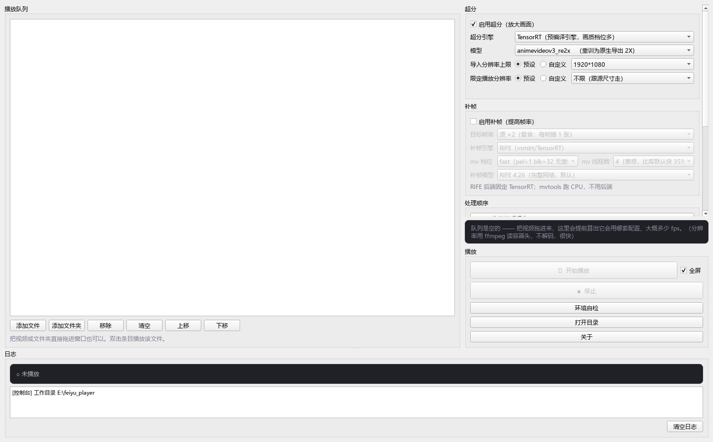
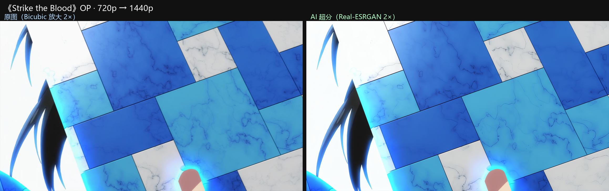
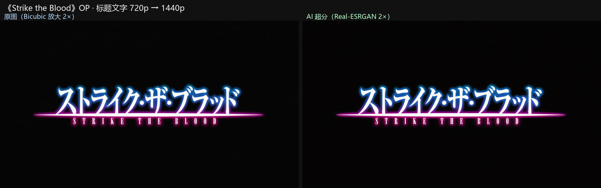
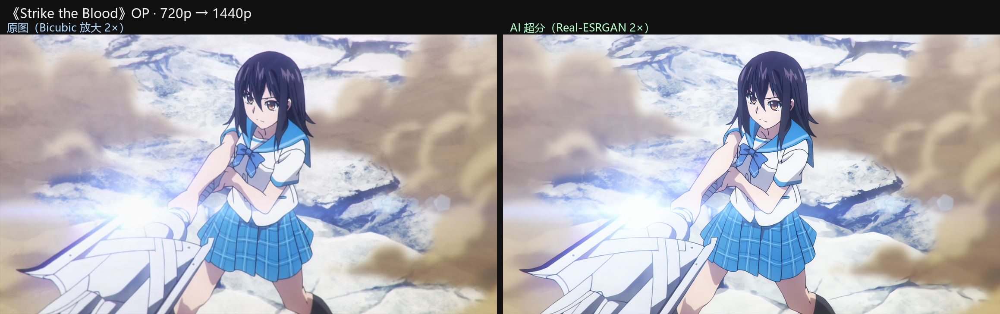

# feiyu_player

> **基于 Real-ESRGAN 和 mpv 的实时超分播放器** —— 边看边超分、边看边补帧，不用先转码、不用等。


**作者**：bilibili **茶茶丸想大摆特摆**  
**完全免费开源**：本项目**没有任何收费项目**，也**不会在任何地方、以任何形式收费**。如果你是通过付费获得的，说明你被第三方欺骗了。

给 mpv 挂 VapourSynth，在**播放的同时**做 AI 超分和帧插值，带一个中文图形界面，参数改完即时生效。  
界面布局：左侧播放队列（下方是日志区），右侧是参数面板；改完点「开始播放」即可。

## 能做什么

| 能力       | 走哪条路                                                                                                                     |
| -------- | ------------------------------------------------------------------------------------------------------------------------ |
| **超分**   | TensorRT 预编译引擎（`realesr-animevideov3` 4x / `re2x` 2x、`AnimeJaNai` 系）；或 **Anime4KCPP** 的 VapourSynth 插件（CNN 系多档，不需要预编译引擎） |
| **补帧**   | **RIFE**（vsmlrt + TensorRT，画质最好）/ **mvtools**（纯 CPU 光流，不占显存）/ 帧复制 / 帧混合                                                  |
| **顺序**   | 「先补帧再超分」/「先超分再补帧」/ 按分辨率自动选（`auto`）                                                                                       |
| **尺寸**   | 「限定播放分辨率」控制**最终输出**尺寸；「导入分辨率上限」控制**超分推理档位**（始终保原始宽高比）                                                                    |
| **设备**   | 超分 / 补帧走 CUDA（N 卡）；CPU 补帧走 mvtools。mpv 程序路径可在界面里更换                                                                       |
| **中文环境** | `mpv_cn/` 提供中文 OSD、中文右键菜单、中文字幕 / 统计页                                                                                     |

GUI 里每个选项都带 tooltip 说明权衡，底部预估卡会列出当前配置最终会跑成什么样。

## 界面



左侧是播放队列（下方接日志区），右侧从上到下是**超分 / 补帧 / 处理顺序 / 播放**四组参数，
底部有「环境自检」「打开目录」「关于」。

## 超分效果对比

每组左为**原始画面**（Bicubic 放大到超分尺寸作对照），右为**同一帧**经
`Real-ESRGAN animevideov3 2×` 超分后的结果（源：720p 动画）：







## 依赖

### 1. Python 侧

```bat
python -m venv .venv
.venv\Scripts\python.exe -m pip install -r requirements.txt
```

### 2. 需要手动准备的组件（不是 pip 包）

| 放到哪                                                          | 是什么                                         | 要不要                |
| ------------------------------------------------------------ | ------------------------------------------- | ------------------ |
| `mpv\mpv.exe`                                                | mpv 播放器本体（选 **启用 vapoursynth** 的构建）         | 必需                 |
| `.venv\Lib\site-packages\vapoursynth\plugins\vstrt.dll`      | VapourSynth 的 **TensorRT** 插件，提供 `core.trt` | 用 TRT 超分 / 补帧就需要   |
| `.venv\Lib\site-packages\vapoursynth\plugins\anime4kcpp.dll` | **Anime4KCPP** 插件，提供 `core.anime4kcpp`      | 用 Anime4KCPP 路线才需要 |

装好后跑一次**环境自检**（GUI 里的按钮，或 `.venv\Scripts\python.exe selfcheck.py`），  
它会逐项检查 mpv / VSScript / 插件 / 引擎 / 模型，缺什么直接告诉你。

### 3. 显卡

TensorRT 路线需要 NVIDIA 显卡 + 匹配的 CUDA / 驱动。  
**没有 N 卡也能用**：超分切到 Anime4KCPP（支持 CPU / OpenCL / CUDA），补帧用 mvtools 或帧复制。

## 快速开始

```bat
:: 方式一：启动图形界面（推荐）
启动控制台.bat

:: 方式二：命令行直接播放（改 bat 里的路径即可）
live_play.bat  "D:\你的片子.mkv"
```

拖视频或文件夹进窗口 → 选好超分 / 补帧 → 点「开始播放」。  
播放中按 **`n`** 可随时查看输出尺寸 / 实际帧率 / 丢帧数。

### 桌面快捷方式（推荐）

想让启动更省事（**不经过 cmd、没有黑框闪烁**、带图标），运行一次：

```bat
.venv\Scripts\python.exe make_shortcut.py
```

它会在项目根生成 **`实时播放器.lnk`** —— 指向 `.venv\pythonw.exe` 并把 `live_gui.py` 当参数传，
**双击即启动、全程没有 cmd 参与**。把它拖到桌面或开始菜单即可；重跑本脚本 = 重建 / 修复快捷方式。


### 打包成单个 exe（可选）

不想每次走 bat / 想直接丢一个文件就能运行，可以把控制台打包成单个 `.exe`：

```bat
.venv\Scripts\python.exe -m pip install pyinstaller
.venv\Scripts\pyinstaller --noconfirm --windowed --onefile --name feiyu_player ^
  --icon console.ico --hidden-import psutil live_gui.py
```

产物 `dist\feiyu_player.exe`（约 37 MB）。**把它放到项目根目录**（与 `mpv\`、`live.vpy`、
`models\`、`mpv_cn\` 同级），双击即可启动 —— exe 会自动在**自身所在目录**找这些资源
（`live_gui.py` 已做打包路径适配）。

> ⚠ exe 里只打包了 **Python 代码 + PySide6**，不含 mpv / 模型 / 引擎 / VapourSynth 环境
> （那些体积大且随机器不同），仍需按上面「依赖」备好、与 exe 同级。

## 模型

`models/` 里已经带上了 **ONNX 权重**，开箱可用：

```
models/
├─ sr_onnx/       realesr-animevideov3（4x 原生）+ realesr-animevideov3_re2x（2x）
├─ animejanai/    AnimeJaNai HD V3.1 四档（Performance / Balanced × 是否加锐）+ SD 档
└─ rife/          RIFE 4.26 与 4.25 lite（补帧）
```

### TensorRT 引擎：**按需自动编译**（一般无需手动跑脚本）

`.engine` **不在仓库里** —— 它是本机编译产物，绑死 GPU 架构（sm_xx）与 TensorRT 版本，
换台机器必然要重编。

**正常使用下你不用手动编译**：

- 在控制台里**导入视频后**，程序会自动按该视频的**源尺寸** + 当前所选模型，**后台把引擎编好**；
- 播放时若仍缺，`live.vpy` 的 `LIVE_SR_BUILD` 会按源尺寸**现场编译**兜底。

因此**模型下拉始终列出全部模型**（不会因为没有引擎就消失），缺引擎时选择照常可用。
首次遇到某个「模型 × 分辨率」需等约 10~20 秒（编完落盘缓存，同尺寸下次秒开）；
模型下拉里鼠标悬停每一项可看该模型**已有档位 / 未编**状态。

> 想**提前批量编**（免得导入 / 播放时等）也可以手动跑：
>
> ```bat
> .venv\Scripts\python.exe build_engines_trt110.py   :: realesr 系
> .venv\Scripts\python.exe build_aj_engines.py       :: AnimeJaNai 系
> ```

> ⚠ **引擎版本必须与运行时插件一致**：TensorRT 的序列化格式不跨大版本，  
> 引擎要用与 `vapoursynth\plugins\vsmlrt-cuda\nvinfer_11.dll` 匹配的 TensorRT 编译。  
> 若编出的 `.engine` 体积**异常巨大（GB 级）**、远超正常的几 MB，  
> 通常是撞上了某个 TensorRT 版本的已知缺陷，换一个稳定版本重编即可。

首次编译比较慢（每个分辨率档位一份，约 30~60 秒），编完落盘缓存，之后秒开。

> 懒得编译的话：超分切到 **Anime4KCPP**，它不需要 `.engine`，开箱即用  
> （不过它只有 2x 网络、画质一般，主要是给跑不动 TRT 的机器兜底）。

### 按源尺寸现编（`LIVE_SR_BUILD`，默认开）

档位表最大只到 **1920×1080**，所以像 **2.076:1** 这类比所有档位都宽的源，  
旧逻辑只能先压进 1920×1080（横向被压缩），超分完再拉回来 —— 中间那次压缩是**纯损失**。

`LIVE_SR_BUILD=1`（默认）改成：**源尺寸没有引擎时，就现场编一个该尺寸的**。

```
2242x1080 的源
  旧：压成 1920x1080（有损） → 2x → 3840x2160 → 缩到 2990x1440
  新：2242x1080（原样）      → 2x → 4484x2160 → 缩到 2990x1440
```

- 代价：**首次**遇到新尺寸要等编译（十几秒），编完落盘缓存，之后同尺寸秒开。
- 想提前编（不必等播放）：`.venv\Scripts\python.exe sr_engine.py re2x 2242x1080`
- **上限保护**（任一命中就退回档位老路、不现编）：短边 >1080（4K 级源）、4x 模型  
  （源×4 输出）、短边 <128。
- 设了「导入分辨率上限」（`LIVE_SR_MAX`）时，现编引擎的目标尺寸会**保持源宽高比**、  
  等比缩到上限以内（只缩不放）—— 限的是算力，**绝不会改变画面比例**。
- `LIVE_SR_BUILD=0` 完全恢复旧行为（只吃档位表）。

## 画面上看统计（全屏也不用切回来）

播放时 mpv 画面**左上角**会显示实时统计（默认开，控制台里可关）：

```
▶ 00:00:31 / 01:31 (34%)            ← mpv 自己的状态行（时间/进度）
实时 24.0 fps　输出 24.0 fps　实际显示 24.0 fps（目标 48）　→ 2560×1440　屏 144Hz
GPU 24% · 1.0/16.0G · RTX 独显 · CPU 7%
```

第二行是硬件状态，由后台采集线程（`SysStat`）每秒刷新：GPU 利用率与显存来自  
`nvidia-smi` 子进程（不用额外依赖），CPU 利用率来自 psutil，硬件型号启动时取一次。  
采集线程只在播放时跑，拿不到 N 卡数据时该行自动消失。

**三个帧率不是一回事，别混**：

| 那一项    | 来源                          | 含义                                         |
| ------ | --------------------------- | ------------------------------------------ |
| **实时** | `estimated-frame-number` 差分 | **实测**播放推进速度，mpv 降速时会掉                     |
| 输出     | `estimated-vf-fps`          | 滤镜链**声明**的输出帧率——不补帧时=源帧率、补帧 2x=48，**恒定不动** |
| 实际显示   | 输出 − 丢帧率                    | 丢帧造成的真实损失                                  |

> mpv 没有现成的「实测渲染 fps」属性，所以「实际显示」只能这样推出来。

实现：`--osd-level=3` 让 level 3 的 OSD 可见，控制台每秒用同一条 IPC 管道推一次  
`show-text`（level 3 = 左上角小字，与 mpv 状态行**分两行、互不覆盖**）。

## 目录结构

```
live_gui.py                图形界面主程序（PySide6）
live.vpy                   VapourSynth 滤镜：超分 / 补帧的全部实现
live_play.bat              命令行启动器（直接调 mpv + live.vpy）
启动控制台.bat             双击启动 GUI
make_shortcut.py           生成快捷方式（零闪烁启动）
live_static.py             相似帧检测（让 RIFE 跳过静态帧）
sr_engine.py               单档引擎现编 / 预编
build_*_engines.py         批量引擎编译脚本
trtexec_py.py              TRT 引擎构建辅助
selfcheck.py               环境自检
vsmlrt/                    本地化的 vsmlrt 库（RIFE 的 VS 封装）
mpv_cn/                    中文 mpv 配置：OSD / 右键菜单 / 统计页 / 快捷键
models/                    ONNX 权重（.engine 需自行编译）
tests/                     回归测试（见下）
console.ico  LICENSE  ui_config.json  requirements.txt  图标 / 许可证 / 配置 / 依赖清单
```

## 已知限制

- **1080p 上「超分 + 补帧」同开很可能供不上**（GPU 吞吐不够，表现为画面一跳一跳、  
  音画错位）。程序**不会自动降档** —— 需要你自己二选一，或调小「限定播放分辨率」、  
  或换更快的模型。720p 源同开一般没有压力。
- 超分模型是**固定倍率**，与导出分辨率无关；`AnimeJaNai` 全系和 Anime4KCPP 都是 **2x**  
  （Anime4KCPP 没有原生 4x 模型，选 3x/4x 时它只做 2x、其余靠 bicubic）。
- 拖进度条用**拖动**而不是单击：单击走精确 seek，会多解码一段（慢），  
  而且 OSC 单击 / 拖动的落点精度不同。

## 测试

```bat
cd tests
..\.venv\Scripts\python.exe _t_gui_smoke.py       :: GUI 配置/联动/布局 回归（主回归）
..\.venv\Scripts\python.exe _t_portable.py        :: 可移植性（路径/依赖）检查
..\.venv\Scripts\python.exe _t_fpsmatrix.py       :: 补帧倍率矩阵
..\.venv\Scripts\python.exe _t_play_cap.py        :: 限定播放分辨率（需 mpv）
..\.venv\Scripts\python.exe _t_a4k_ui.py          :: 超分引擎切换 + 布局
..\.venv\Scripts\python.exe _t_fs_check.py        :: 全屏开关（需 mpv）
..\.venv\Scripts\python.exe _t_playcap_parity.py  :: VS 与 GUI 的尺寸语义一致性
..\.venv\Scripts\python.exe _t_vfr_probe.py       :: VFR 源判定
```

`_t_gui_smoke.py` 是主回归，改完 GUI 先跑它。

## 致谢

[mpv](https://mpv.io/) ·  
[VapourSynth](https://www.vapoursynth.com/) ·  
[vs-mlrt](https://github.com/AmusementClub/vs-mlrt) ·  
[Anime4KCPP](https://github.com/TianZerL/Anime4KCPP) ·  
[RIFE](https://github.com/hzwer/ECCV2022-RIFE) ·  
[AnimeJaNai](https://github.com/the-database/mpv-upscale-2x_animejanai) ·  
[Real-ESRGAN](https://github.com/xinntao/Real-ESRGAN)

## 关于


- **作者**：bilibili **茶茶丸想大摆特摆**
- **完全免费、开源**：供个人学习 / 使用**永久免费**，没有任何付费墙、广告或后台上报；代码全部开源，欢迎随意查看、修改、二次分发。
- **本质是一条串联脚本**：把 mpv、VapourSynth、vs-mlrt、RIFE、Anime4KCPP 等现成开源组件用 `live.vpy` 串起来，**真正的超分 / 补帧能力都来自上方「致谢」里的上游项目**。

> **免责声明**：本项目按「现状」提供，不对播放效果、硬件兼容性，或任何使用后果作任何担保；自行编译引擎、替换模型、或接入第三方 mpv 构建所产生的风险，均由使用者自行承担。

### 协议（License）

本项目是上述组件的**组合 / 衍生作品**。因为链路里同时含 **GPL-2.0**（mpv）与 **GPL-3.0**（vs-mlrt、Anime4KCPP、AnimeJaNai 脚本）这类强 copyleft 协议，二者都带「or later」、可向上兼容，所以**本项目整体以 GPL-3.0-or-later 发布**。完整许可证文本见仓库根目录的 `LICENSE` 文件。

| 组件                                                                                      | 角色                     | 协议                              |
| --------------------------------------------------------------------------------------- | ---------------------- | ------------------------------- |
| [mpv](https://mpv.io/)                                                                  | 播放器本体                  | GPL-2.0-or-later                |
| [VapourSynth](https://www.vapoursynth.com/)                                             | 滤镜框架                   | LGPL-2.1-or-later               |
| [vs-mlrt](https://github.com/AmusementClub/vs-mlrt)                                     | TRT / ONNX / ncnn 推理后端 | GPL-3.0-or-later                |
| [Anime4KCPP](https://github.com/TianZerL/Anime4KCPP)                                    | Anime4K 超分             | GPL-3.0                         |
| [mpv-upscale-2x\_animejanai](https://github.com/the-database/mpv-upscale-2x_animejanai) | AnimeJaNai 超分脚本        | GPL-3.0-or-later                |
| [RIFE](https://github.com/hzwer/ECCV2022-RIFE)                                          | 补帧                     | Apache-2.0                      |
| [Real-ESRGAN](https://github.com/xinntao/Real-ESRGAN)                                   | 超分（代码 + 模型）            | 代码 Apache-2.0 / 模型 BSD-3-Clause |

> ⚠ **模型权重的额外限制**：AnimeJaNai 系列模型（`.onnx`）采用 **CC-BY-NC-SA-4.0**（署名-非商业性-相同方式共享），**不得用于商业用途**。它们只是被本项目调用，不影响本项目代码本身的 GPL 授权；其余模型（Real-ESRGAN 系 BSD-3-Clause、RIFE Apache-2.0）无此限制。
